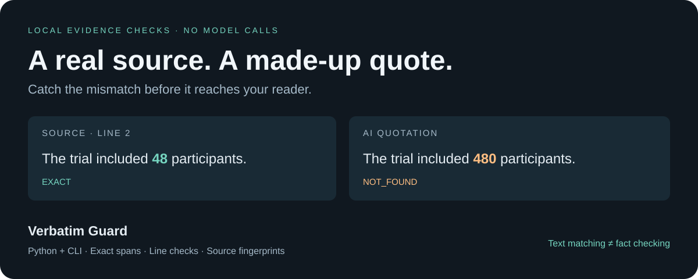

<div align="center">

# Verbatim Guard

**Did the AI actually quote your source?**

Check quotations, line ranges, and source fingerprints — locally, without another model.

[](https://github.com/waiteddegree608-ship-it/verbatim-guard/actions/workflows/ci.yml)
[](pyproject.toml)
[](pyproject.toml)
[](LICENSE)

[中文说明](README.zh-CN.md) · [Try the demo](#try-it-in-a-minute) · [GitHub Action](#check-evidence-in-pull-requests) · [Python API](#python-api) · [Releases](https://github.com/waiteddegree608-ship-it/verbatim-guard/releases)



</div>

A real source can still be misquoted. A correct quote can still point to the wrong lines. A quote that used to be valid can outlive the source version it came from.

Verbatim Guard checks those mechanical errors before you show a generated answer or accept a document change. It is a small Python library and CLI, with no runtime dependencies, model calls, telemetry, or URL fetching. **It checks textual evidence, not factual truth or whether a quote supports a broader claim.**

## Try it in a minute

Python 3.10 or later. Install the versioned wheel directly from GitHub; no Git client or API key is needed:

```sh
python -m pip install "https://github.com/waiteddegree608-ship-it/verbatim-guard/releases/download/v0.2.0/verbatim_guard-0.2.0-py3-none-any.whl"
verbatim-guard demo --mode whitespace
```

```text
Verbatim Guard | whitespace mode

EXACT            faithful (study.txt)  L2-2
NOT_FOUND        invented-number (study.txt)
WRONG_LOCATION   wrong-line (study.txt)
AMBIGUOUS        repeated (study.txt)  L4-4, L5-5
MISSING_SOURCE   missing-document (missing.txt)
WHITESPACE       wrapped (study.txt)  L6-7

2/6 passed; 4 need attention.
Text matching does not establish factual truth or semantic support.
```

The demo intentionally contains bad quotations and **exits with code 1**. That is the expected result. To produce a self-contained, offline HTML report:

```sh
verbatim-guard demo --mode whitespace --format html --output report.html
```

Open `report.html` in your browser. Or download the synthetic [sample HTML report](https://github.com/waiteddegree608-ship-it/verbatim-guard/releases/download/v0.2.0/demo-report.html). Reports contain matching source excerpts; inspect them before sharing.

Prefer a source install?

```sh
git clone https://github.com/waiteddegree608-ship-it/verbatim-guard.git
cd verbatim-guard
python -m pip install .
verbatim-guard check examples/passing.json
```

The package is distributed through GitHub Releases for this version. It is **not published to PyPI**.

## Check evidence in pull requests

Add an evidence check to your repository. It fails on bad quotations and writes error annotations plus a job summary. No pip install or API key is needed for the action.

Save this as `.github/workflows/evidence.yml` and copy [examples/passing.json](examples/passing.json) to `evidence.json` to try it:

```yaml
name: Evidence checks
on: [push, pull_request]
permissions:
  contents: read
jobs:
  evidence:
    runs-on: ubuntu-latest
    steps:
      - uses: actions/checkout@v4
      - uses: actions/setup-python@v5
        with:
          python-version: '3.13'
      - uses: waiteddegree608-ship-it/verbatim-guard@v0.2.0
        with:
          bundle: evidence.json
          mode: exact
```

Use your own source text and quotations after trying the example. The action returns counts as outputs, emits up to 50 error annotations, and summarizes every result. It does not publish your source excerpts. [Inputs, outputs, and limitations →](docs/github-action.md)

## What it catches

| Result | Meaning | Passes? |
| --- | --- | --- |
| `EXACT` | One literal match in the allowed source range | Yes |
| `WHITESPACE` | One match after explicitly enabled whitespace folding | Yes |
| `NOT_FOUND` | Quotation absent under the selected mode | No |
| `WRONG_LOCATION` | Quote exists elsewhere, outside the supplied lines | No |
| `AMBIGUOUS` | At least two matches in the allowed range | No |
| `SOURCE_CHANGED` | Supplied fingerprint differs from the current text | No |
| `MISSING_SOURCE` | Source ID is missing from the input bundle | No |
| `EMPTY_QUOTE` | Empty or whitespace-only quote | No |
| `INVALID_LINES` | Reversed or out-of-bounds line range | No |

If you supply a fingerprint, a changed source is rejected before matching. A line range narrows the search: it can select one occurrence from repeated text. At most two matches are returned, so two means **at least two**, not necessarily exactly two.

## Python API

```python
from verbatim_guard import fingerprint, verify

source = "Pilot study\nThe trial included 48 participants.\n"
result = verify(
    "The trial included 48 participants.",
    source,
    lines=(2, 2),
    source_sha256=fingerprint(source),
)

assert result.ok
assert result.status == "EXACT"
match = result.matches[0]
assert source[match.start:match.end] == match.text
print(result.to_dict())
```

Save the fingerprint **when you extract the evidence** and compare it against later source text. Computing a fresh fingerprint immediately before every check cannot detect changes to an earlier version.

For structured output from any model:

```python
from verbatim_guard import check_bundle

report = check_bundle({
    "sources": {"paper": "The trial included 48 participants."},
    "claims": [{
        "id": "sample-size",
        "source": "paper",
        "quote": "The trial included 480 participants."
    }]
})

assert not report["ok"]
assert report["results"][0]["status"] == "NOT_FOUND"
```

Use the failure to request corrected evidence, ask for review, or withhold a proposed edit. See [the runnable integration example](examples/from_model.py). The word `claims` names input records; the validator checks their quotations, not the truth of any surrounding argument.

## JSON input and CI

Bundles are self-contained. **Source values are literal text, never paths or URLs.** The tool reads only the bundle file you specify (or stdin).

```json
{
  "sources": {"study.txt": "Pilot study\nThe trial included 48 participants.\n"},
  "claims": [{
    "id": "sample-size",
    "source": "study.txt",
    "quote": "The trial included 48 participants.",
    "lines": [2, 2]
  }]
}
```

`lines` and `source_sha256` are optional. IDs must be non-empty; claim IDs must be unique. Unknown fields and duplicate JSON keys are rejected rather than silently ignored.

```sh
verbatim-guard check evidence.json --format json --output report.json
# Also accepts stdin:
cat evidence.json | verbatim-guard check -
```

| Exit code | Meaning |
| --- | --- |
| `0` | Every quotation passed |
| `1` | At least one evidence check failed |
| `2` | Invalid input, malformed JSON, or a file error |

For a CI step, run `verbatim-guard check evidence.json`; failure stops the step without custom parsing. JSON reports include `schema_version`, `mode`, a summary, and one result per claim.

## Matching contract

- **Exact by default.** Case, punctuation, Unicode code points, and whitespace must match. There is no fuzzy matching or ellipsis expansion.
- **Optional whitespace mode.** `--mode whitespace` collapses each Unicode whitespace run to one space and trims quote-edge whitespace. It does not normalize accents, letter width, punctuation, or case. This changes what passes, so opt in deliberately.
- **Original coordinates.** Offsets count Python Unicode characters, start at zero, and use an exclusive end. They are not byte offsets or JavaScript UTF-16 offsets. Lines are 1-based and inclusive; LF, CRLF, and CR are supported. A final newline is not an extra physical line.
- **Fingerprints.** SHA-256 covers the supplied source string encoded as UTF-8, preserving newline characters. It is not necessarily the hash of the original PDF or raw file bytes. Pass a source read with `open(path, encoding="utf-8", newline="")` if preserving file newlines matters.
- **Boundaries.** CLI bundles are limited to 8 MiB; bundles allow 1–100 sources and 1–1,000 claims. Empty batches are rejected. The single-quote Python API expects the caller to bound untrusted input sizes.

## Scope and limitations

Use this for RAG evidence spans, paper-review comments, document edits, and regression fixtures where you already have extracted source text. It does not extract quotes from arbitrary prose, parse PDFs, run OCR, retrieve URLs, validate a DOI, detect retractions, or establish semantic entailment. Incorrect PDF extraction may cause legitimate quotations to fail. An untrustworthy source can contain a perfectly matching false statement. A short common phrase may match accidentally; choose meaningful quotations and check their context.

This first release is a narrow, independently implemented utility inspired by the needs of a local paper-review workflow. The synthetic demo and tests establish behavior on their fixtures; they are not a real-world accuracy benchmark.

## Related work

- [grounded](https://github.com/fc0web/grounded) describes a broader offline grounding checker.
- [citation-verifier](https://github.com/rlfordon/citation-verifier) includes legal citation and quotation workflows.
- [llm-citation-extract](https://github.com/MukundaKatta/llm-citation-extract) extracts citation syntax from model output.

Verbatim Guard focuses on a small explicit input contract, conservative matching, and original-source coordinates. It is not a replacement for those broader workflows; no comparative accuracy or speed advantage is claimed.

## Contribute

Small failing examples are especially useful: unusual line endings, whitespace mapping, repeated passages, or malformed input. Please use synthetic text instead of private documents. See [CONTRIBUTING.md](CONTRIBUTING.md).

If this helps your workflow, a star makes it easier to find again. A reproducible bug report or a real integration example is welcome too.

[MIT license](LICENSE).
